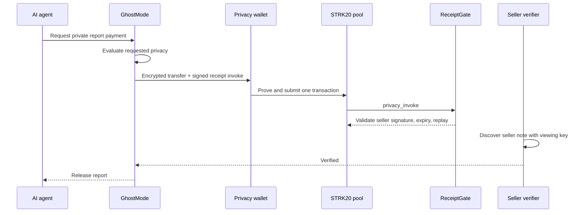
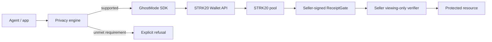

# GhostMode

**A privacy policy and execution layer that lets AI agents pay on Starknet without silently downgrading requested privacy.**

GhostMode answers one question before an agent acts: *can this action actually meet the privacy properties it requested?* If yes, it prepares a reviewed STRK20 Wallet API route. If not, it refuses with an explicit reason. It never relabels a normal Starknet transfer as private.

## The problem

An autonomous agent's payment graph can reveal its owner, vendors, budget, assets, strategy, and operating rhythm. Hiding an address in a UI changes none of that. General Starknet contracts also cannot become private merely because a frontend calls them through a “privacy” button.

## The solution

GhostMode combines four concrete pieces:

1. An explainable privacy engine and 100-point score.
2. Wallet-managed STRK20 shielding, balances, private transfers, and one-invoke routes.
3. A seller-signed Cairo receipt gate that binds an opaque request to the same atomic pool transaction.
4. A read-only seller verifier that releases a resource only after discovering the matching private note.



## Demo

The included AI Research Agent buys a **Premium AI Market Intelligence Report**. The server returns HTTP 402 with an opaque, seller-authorized request. GhostMode shows the real disclosure matrix, the wallet simulates and submits an encrypted transfer plus receipt invocation, and the report remains locked until both the public receipt and seller's private note are verified.

```bash
npm install
cp .env.example .env.local
npm run demo
```

No funded wallet? The compatibility checker and privacy evaluation remain usable, but GhostMode labels that path as analysis—not blockchain success.

## Architecture



- The browser never receives a viewing key, private key, decrypted note, or proof secret.
- The privacy wallet handles note discovery and proof generation.
- The seller verifier is a separate Node 24 service with a narrow authenticated interface.
- The demo quote store is process-local. Production deployments must replace it with durable transactional storage.

## Privacy guarantees

| Surface | STRK20 encrypted transfer | Private invoke caveat |
|---|---|---|
| Sender inside pool | Private | Private note owner remains private |
| Recipient | Private in encrypted note | Invoked helper is public |
| Amount | Private in encrypted note | Open-note amount may be public |
| Token | Private in encrypted note | Open-note token may be public |
| Spent-note link | Private | Private |
| Transaction timing | Public | Public |
| Shield deposit / unshield withdrawal | Public | Public |
| HTTP/IP metadata | Out of scope | Out of scope |

ReceiptGate publishes an opaque request ID and resource commitment. It does not publish buyer, seller-recipient address, token, or amount. The seller's quote-authority public key is public. See [Privacy model](docs/PRIVACY_MODEL.md) and [Threat model](docs/THREAT_MODEL.md).

## Why Starknet and STRK20

Starknet gives GhostMode programmable Cairo verification and account abstraction. STRK20 supplies the part the application cannot reproduce: shielded balances, encrypted notes, nullifiers, private transfers, wallet-held viewing keys, and proof-backed state transitions. Remove STRK20 and GhostMode becomes only a policy checker around public payments—the core product no longer works.

## Features

- Strict `evaluatePrivacy(intent)` with no automatic public fallback
- Explicit routes: `STRK20_PRIVATE_TRANSFER`, `STRK20_PRIVATE_INVOKE`, `PUBLIC_STARKNET`, `UNSUPPORTED`
- Explainable score with fixed documented weights
- Dynamic Wallet Standard discovery and STRK20 capability detection
- Shield, read shielded balance, private payment, simulation, timeout recovery
- V1 agent payment request validation and replay-aware status
- Seller-signed receipt authorization and Cairo replay/expiry enforcement
- Authenticated seller-note verification and fail-closed resource release
- API health checks that expose status, never secrets
- Read-only mainnet check and guarded mainnet deployment

## Repository structure

```text
src/app/                 Next.js UI and API routes
src/lib/ghostmode/       policy engine, request parser, SDK, adapters
cairo/                   ReceiptGate and Starknet Foundry tests
seller-verifier/         isolated STRK20 Privacy SDK service
scripts/                 deployment, verification, mainnet safety
docs/                    architecture, operations, privacy, security
e2e/                     agent-payment integration flow
```

## Quick start

Requirements: Node 24, npm 11, a privacy-compatible Starknet wallet, and an RPC endpoint. Contract development additionally uses Scarb 2.20.1, Cairo 2.20.0, Starknet Foundry 0.63.0, and Universal Sierra Compiler.

```bash
npm install
cp .env.example .env.local
npm run dev
```

Read [Quickstart](docs/QUICKSTART.md) for every environment variable and the seller service.

## Tests

```bash
npm run lint
npm run typecheck
npm test
npm run test:e2e
npm run build

cd cairo
scarb build
scarb test
```

## Sepolia deployment

Generate a quote-only signing pair, store the private key in server secrets, and deploy ReceiptGate with the public key:

```bash
npm run quote-signer:generate
GHOSTMODE_QUOTE_SIGNER_PUBLIC_KEY=0x... npm run deploy:sepolia
npm run gate:verify -- 0x...
```

The contract interface changed to add seller authorization. The older Sepolia deployment recorded in `cairo/address.md` is historical and **must not be configured for this build**. See [Sepolia deployment](docs/SEPOLIA_DEPLOYMENT.md).

## Mainnet test mode

```bash
npm run mainnet:check       # read calls only
npm run mainnet:dry-run     # no transaction submission
```

Mainnet UI displays **MAINNET — REAL FUNDS**, disables fixed one-STRK shielding, and asks for confirmation before payment. Deployment aborts unless `CONFIRM_MAINNET_DEPLOYMENT=true`. GhostMode never deploys, shields, transfers, or unshields mainnet funds automatically. See [Mainnet](docs/MAINNET.md).

## Agent SDK

```ts
import { GhostMode } from "./src/lib/ghostmode";

const ghost = new GhostMode({ network: "sepolia", wallet });
const evaluation = ghost.evaluate(intent);
if (!evaluation.supported) throw new Error(evaluation.reason);
const { transaction_hash } = await ghost.pay(paymentRequest);
const result = await ghost.verify(paymentRequest.requestId, transaction_hash);
```

See [Agent SDK](docs/AGENT_SDK.md).

## API example

```bash
curl -X POST http://localhost:3000/api/privacy/evaluate \
  -H 'content-type: application/json' \
  -d '{"action":"payment","network":"starknet-sepolia","token":"0x4718","amount":"100","requirements":{"hideSender":true,"hideRecipient":true,"hideAmount":true,"hideToken":true}}'
```

See [API](docs/API.md).

## Smart contract and seller verification

ReceiptGate accepts calls only from its pinned STRK20 pool, verifies a Stark-curve seller signature scoped to its own contract address, rejects expired or replayed requests, and returns the exact empty `Span<OpenNoteDeposit>` expected by the pool. It does **not** inspect encrypted payment contents. Resource release additionally requires the isolated seller verifier to discover one unambiguous note in the accepted transaction's block. See [Receipt contract](docs/RECEIPT_CONTRACT.md) and [Seller verification](docs/SELLER_VERIFICATION.md).

## Security and limitations

- Process-local quote/status state is demo-only and not safe across replicas.
- Note verification matches seller, token, amount, accepted block, and gate receipt; it rejects ambiguous matches. The current SDK does not expose a quote ID embedded in an encrypted note.
- Traffic analysis, wallet fingerprinting, RPC metadata, malicious browser extensions, and shield/unshield correlation remain possible.
- A private invoke does not hide arbitrary target contract calldata or state.
- A real wallet/prover/network transaction is still required for live success; automated integration tests use typed wallet adapters, not fabricated hashes.

Read [Security](docs/SECURITY.md), [Compatibility](docs/COMPATIBILITY.md), and [Troubleshooting](docs/TROUBLESHOOTING.md).

## For Hackathon Judges

In under two minutes:

1. Open the workbench and inspect `/api/demo-intel`.
2. Read the requested-versus-actual exposure matrix and score.
3. Notice that unsupported privacy requirements are rejected rather than downgraded.
4. With the configured Sepolia wallet and services, submit the atomic payment and unlock the report.
5. Run `npm test`, `npm run test:e2e`, and `cd cairo && scarb test`.

The innovation is not a privacy-themed checkout. It is a reusable, honest privacy compiler plus an atomic, seller-authorized private-payment receipt for AI agents.

## Current limitations

| Limitation | Why | Impact | Future solution |
|---|---|---|---|
| Ephemeral quote store | Hackathon deployment has no database | Restart loses pending quotes | Transactional Redis/Postgres adapter |
| Seller verifier holds an account signer | Current lower-level SDK setup requires an `Account` | Service isolation is critical | Official viewing-only interface when available |
| Same-block note matching | Encrypted note exposes no request ID to verifier | Ambiguous equal payments are rejected | Protocol-supported payment tag/proof |
| Wallet E2E needs manual approval | Browser wallets and proving are user-controlled | CI cannot prove a real payment | Isolated wallet harness when supported |
| Shield/unshield edges are public | STRK20 privacy boundary design | Correlation remains possible | Batching and operational privacy hygiene |

## Roadmap

- Durable quote/status adapter with atomic compare-and-set
- Audited deployment of the signed ReceiptGate on Sepolia, then mainnet
- OHTTP/pinned discovery transport for the seller verifier
- Published `@ghostmode/sdk` package after API stabilization
- More reviewed one-invoke adapters without overstating calldata privacy

## Hackathon notes

`strk20.json` is the submission metadata. Mainnet transactions and final contract addresses should be added only after real execution. No transaction or deployment in this repository is fabricated.

## License

[MIT](LICENSE)
