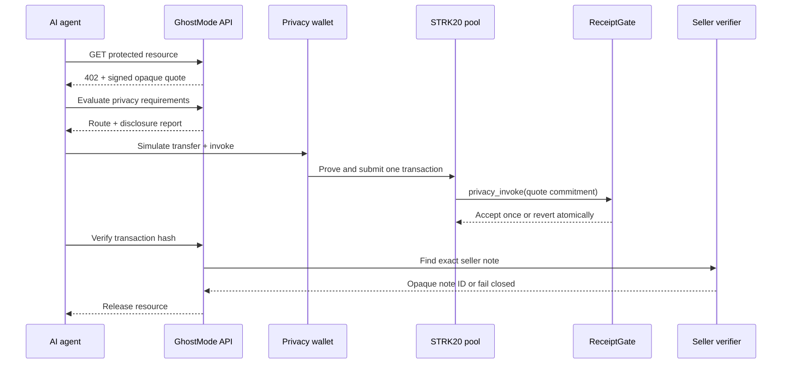
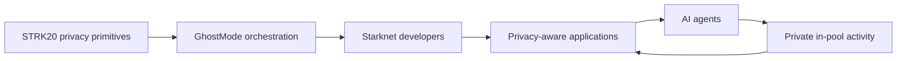
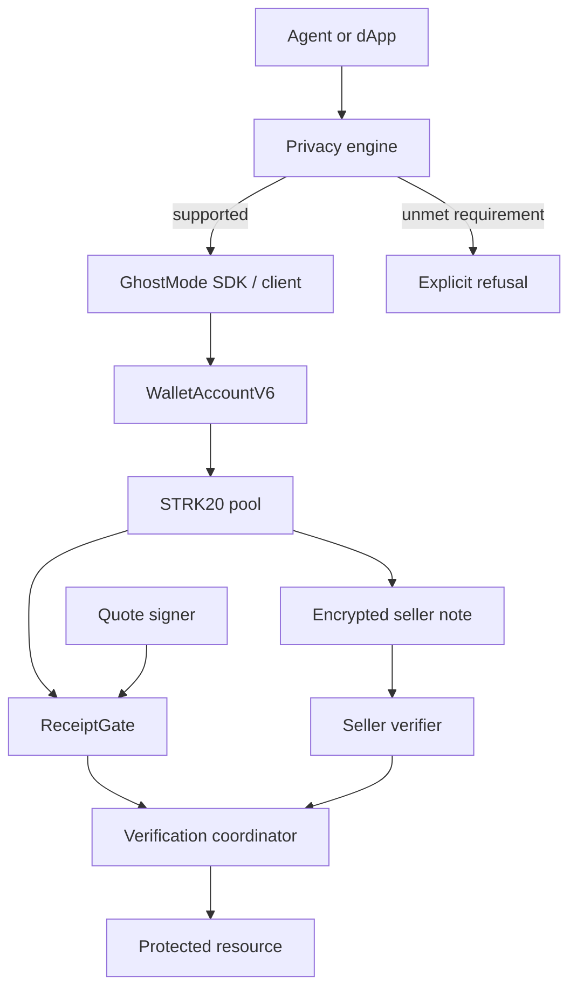

# GhostMode

**Privacy-aware execution for AI agents on Starknet.**

GhostMode evaluates what an agent action would reveal, chooses a supported STRK20 route, and refuses to submit when the requested confidentiality cannot be met. The flagship flow is an HTTP 402-style purchase: an agent pays a seller with an encrypted STRK20 note, records an opaque receipt in the same pool transaction, and receives the resource only after both sides of the payment are verified.

> [!IMPORTANT]
> GhostMode is a hackathon prototype, not an audited payment product. The policy engine, SDK, API, Cairo contract, and local verification flow are implemented and tested. A current ReceiptGate and seller verifier are not configured in this repository, so the complete live Sepolia purchase still requires deployment and manual wallet testing.

## For judges

| Question | Answer |
|---|---|
| What did we build? | A privacy policy engine, wallet-keyless agent SDK, STRK20 action builder, signed Cairo receipt gate, and seller-side note verifier. |
| What problem does it solve? | Public agent wallets can expose strategy, suppliers, budgets, and service usage through repeated payments. |
| Where is STRK20 used? | Shielded balances, encrypted transfers, Wallet API proving/submission, and the atomic `privacy_invoke` receipt action. |
| What is private? | In a normal encrypted pool transfer: the in-pool sender/recipient relationship, token, amount, and spent-note linkage. |
| What remains observable? | Shield/unshield edges, transaction timing, STRK20 use, ReceiptGate address, opaque quote commitment, and offchain network metadata. |
| What should I test? | Privacy refusal, compatibility analysis, quote inspection, wallet capability detection, unit/integration tests, and the Cairo replay/authorization tests. |
| Is the full payment live? | Not yet. The current signed ReceiptGate and seller verifier are not configured; the older Sepolia gate is ABI-incompatible. |

Core implementation: [`src/lib/ghostmode/`](src/lib/ghostmode/), [`src/app/api/`](src/app/api/), [`cairo/src/lib.cairo`](cairo/src/lib.cairo), and [`seller-verifier/`](seller-verifier/).

## The problem

AI agents increasingly need wallets. They can pay for data, APIs, subscriptions, compute, research, suppliers, and other agents.

A normal blockchain wallet can behave like a **glass wallet**: anyone watching may see where money goes, when it moves, how much is spent, and which applications are used. That transparency is valuable for verifying state, but not every economic action should reveal an operator's strategy.

- A trading agent's payments can reveal its preferred signal provider.
- A research agent's purchases can reveal which market a company is investigating.
- A procurement agent's history can expose suppliers and spending patterns.
- A SaaS agent's wallet can become a public map of its software stack.

Creating another public address does not solve this; the new address accumulates its own linkable behavior. Masking an address in CSS, shortening it in a UI, Base64-encoding data, or hiding a public transfer behind a server also does not create onchain privacy.

### Why this becomes more important for AI agents

A person may make a few manual transactions. An agent may eventually make hundreds, thousands, or millions of machine-to-machine payments. The risk is no longer one visible transaction; it is that an observer can reconstruct behavior over time—preferred suppliers, schedules, budgets, data sources, strategies, and relationships.

As software becomes capable of independently spending money, **transaction privacy becomes part of application security**.

## How GhostMode solves it

GhostMode sits between an agent's intent and Starknet. Before execution, it asks: **what will this action reveal?**

1. Receive a typed agent intent or payment request.
2. Evaluate the requested sender, recipient, amount, and token confidentiality.
3. Explain what can remain private and what will still be observable.
4. Select a reviewed STRK20 transfer or one-invoke route.
5. Simulate through the user's privacy-capable wallet.
6. Submit only after the wallet confirms.
7. Verify the public receipt and the seller's matching private note.
8. Release the resource and report the final state.

If a requested privacy property cannot be satisfied, GhostMode returns `UNSUPPORTED`. It does not silently execute a public transaction and call it private.

### The key idea

GhostMode is not just “private payments.” Its abstraction is **privacy-aware execution**: an agent describes an action and its privacy requirements; GhostMode decides how—or whether—it can execute.

Implemented capabilities include strict privacy evaluation, a deterministic disclosure score, Wallet API capability detection, shield/balance/private-payment actions, simulation-before-submit, timeout recovery, a typed agent SDK, an HTTP API, a seller-authorized receipt contract, fail-closed note verification, and a compatibility compiler for other Starknet actions.

```text
WITHOUT GHOSTMODE                  WITH GHOSTMODE

Agent                              Agent
  ↓                                  ↓
Public wallet                      GhostMode policy
  ↓                                  ↓
Seller                             Supported STRK20 route
                                     ↓
Observer may see                  Seller / application
payer → seller → token → amount
                                  Observer still sees the metadata
                                  the selected route cannot hide.
```

## Demo flow

The included workbench uses an HTTP `402 Payment Required`-style endpoint for a threat-intelligence report. This is a GhostMode draft format (`ghostmode-x402/0.1`), not a claim of compatibility with every x402 implementation.



Run the analysis-only experience locally:

```bash
nvm use
npm ci
cp .env.example .env.local
npm run dev
```

Open <http://localhost:3000>. Quote creation requires the quote-signing environment variables. Live shielding or payment additionally requires a compatible wallet and funded Sepolia account. Follow the [quickstart](docs/quickstart.md) and [demo guide](docs/demo.md).

## Why this matters to Starknet

STRK20 provides privacy primitives. GhostMode turns those primitives into application workflows.

> STRK20 answers: “How can private token movement work?”<br>
> GhostMode answers: “How can an application or AI agent use that movement to complete a real task without overstating privacy?”

Concrete ecosystem value:

- **Usable integration:** developers get typed intents, route selection, action builders, errors, receipts, and verification rather than rebuilding orchestration.
- **Private machine commerce:** agents can buy APIs, reports, data, compute, or services through supported private payment routes.
- **Commercial confidentiality:** supported in-pool payments reduce public disclosure of payment relationships and amounts.
- **Understandable privacy UX:** every result separates `private`, `counterparty`, `public`, and unsupported surfaces.
- **Safer claims:** unsupported calldata privacy, private contract state, or multi-invoke flows are rejected explicitly.
- **Reusable infrastructure:** the SDK and compatibility compiler can serve agent frameworks, marketplaces, SaaS products, and Starknet dApps.



Starknet is relevant because GhostMode composes the STRK20 pool, wallet-managed proof flow, Cairo helper contracts, and Starknet's native account model. Without STRK20, the project would be a policy checker around public transfers; its central execution path would disappear.

### Why not just use STRK20 directly?

Applications still need privacy-requirement evaluation, wallet capability handling, route selection, payment request validation, simulation, replay protection, receipts, seller verification, resource release, recovery, and honest explanations of remaining leakage. GhostMode supplies that application layer; it does not replace the pool, wallet, prover, or discovery service.

### Why not a mixer?

GhostMode is not a deposit-mix-withdraw product. It connects a supported private pool action to an application result: a payment, receipt, verification decision, and resource release.

## What GhostMode could unlock

- Private data and research marketplaces
- Private per-request API payments
- Confidential purchasing of model inference or compute
- Trading agents buying signals without a direct public payer-to-provider edge
- B2B procurement with reduced exposure of supplier relationships
- Agent-to-agent service requests with payment and delivery verification

These are future integration directions, not claims that every scenario is implemented today.

## Privacy guarantees

| Surface | Classification | Reason |
|---|---|---|
| In-pool sender/recipient relationship | Private for an encrypted transfer | Ownership is proven from notes; the relationship is not published as a normal account transfer. |
| Encrypted-note token and amount | Private | Normal notes encrypt these fields. |
| Spent-note linkage | Private | The spend publishes a nullifier rather than the consumed note link. |
| Seller's received payment | Known to seller | The recipient can decrypt its own note. |
| ReceiptGate address and invocation | Public | The helper call is part of the Starknet transaction. |
| Quote ID, resource commitment, expiry, signature | Public | These are ReceiptGate calldata/event data; the ID and commitment are opaque but observable. |
| Open-note token and amount | Public | STRK20 open notes intentionally expose these output fields. |
| Shield deposit | Public | Depositor, token, amount, pool, and timing are visible. |
| Unshield withdrawal | Public | Recipient, token, amount, pool, and timing are visible. |
| Transaction timing and STRK20 use | Public | Block placement and pool interaction are observable. |
| HTTP, IP, RPC, wallet fingerprint | Out of scope | STRK20 is not a network-anonymity system. |

### What GhostMode does not protect

GhostMode does not hide public entry/exit edges, arbitrary contract calldata or state, HTTP requests, IP addresses, wallet fingerprints, browser storage, RPC metadata, compromised devices, or information intentionally learned by the seller. It does not prove that a purchased resource is truthful. The commitment can be recomputed to check byte identity, but the current UI does not yet perform that client-side check. See the [privacy model](docs/privacy-model.md), [threat model](docs/threat-model.md), and [limitations](docs/limitations.md).

## Architecture



Read the full [architecture](docs/architecture.md), including trust boundaries, failure paths, design decisions, and extension points.

## Where is the code?

| Feature | Implementation |
|---|---|
| Privacy evaluation | [`src/lib/ghostmode/privacy-engine.ts`](src/lib/ghostmode/privacy-engine.ts) |
| Privacy score | [`src/lib/ghostmode/privacy-score.ts`](src/lib/ghostmode/privacy-score.ts) |
| Compatibility compiler | [`src/lib/ghostmode/compatibility.ts`](src/lib/ghostmode/compatibility.ts) |
| Agent SDK | [`src/lib/ghostmode/sdk.ts`](src/lib/ghostmode/sdk.ts) |
| Wallet action builders | [`src/lib/ghostmode/wallet-actions.ts`](src/lib/ghostmode/wallet-actions.ts) |
| Payment request validation | [`src/lib/ghostmode/payment-request.ts`](src/lib/ghostmode/payment-request.ts) |
| HTTP 402-style quote | [`src/app/api/demo-intel/route.ts`](src/app/api/demo-intel/route.ts) |
| Payment verification/release | [`src/app/api/demo-intel/unlock/route.ts`](src/app/api/demo-intel/unlock/route.ts) |
| Receipt contract | [`cairo/src/lib.cairo`](cairo/src/lib.cairo) |
| Seller note verifier | [`seller-verifier/src/server.mjs`](seller-verifier/src/server.mjs) |
| TypeScript tests | [`src/lib/ghostmode/`](src/lib/ghostmode/) and [`e2e/`](e2e/) |
| Cairo tests | [`cairo/tests/test_receipt_gate.cairo`](cairo/tests/test_receipt_gate.cairo) |

### Repository structure

```text
ghostmode-starknet/
├── src/app/                 Next.js workbench and server routes
├── src/lib/ghostmode/       policy, SDK, actions, adapters, verification
├── cairo/                   ReceiptGate contract and Foundry tests
├── seller-verifier/         isolated Privacy SDK note-discovery service
├── e2e/                     mocked-wallet SDK integration tests
├── scripts/                 network checks and guarded deployments
├── docs/                    product, developer, privacy, and operations docs
├── strk20.json              hackathon discovery metadata
└── .env.example             secret-free configuration template
```

## Quickstart

Requirements: Node.js 24, npm 11, and an RPC endpoint. Live private actions also require a privacy-capable wallet. Cairo development uses Scarb 2.20.1, Cairo 2.20.0, Starknet Foundry 0.63.0, and Universal Sierra Compiler 2.10.0 in the verified local setup.

```bash
nvm use
npm ci
cp .env.example .env.local
npm run dev
```

Configuration, seller setup, and live-flow requirements are in [Quickstart](docs/quickstart.md) and [Configuration](docs/configuration.md).

## Build and test

```bash
npm run check
cd cairo
scarb test
```

`npm run test:e2e` currently tests the SDK transaction sequence with a mocked wallet; it is not a live browser-wallet or public-network E2E test. See [Testing](docs/testing.md) for the verified results and manual wallet test boundary.

## Deployment status

| Network | Component | Status |
|---|---|---|
| Starknet Sepolia | STRK20 pool | Read-only contract check passed on 2026-08-29. |
| Starknet Sepolia | Current signed ReceiptGate | Not configured or verified. |
| Starknet Sepolia | Historical ReceiptGate | Deployed, but ABI-incompatible with this build; do not configure it. |
| Starknet Mainnet | STRK20 pool | Read-only contract check passed on 2026-08-29. |
| Starknet Mainnet | ReceiptGate | Not deployed or configured. |

No compatible deployment address or mainnet transaction is recorded in `strk20.json`. Follow [Sepolia](docs/sepolia.md) first, then the guarded [Mainnet guide](docs/mainnet.md).

## Documentation

Start with the [documentation map](docs/README.md):

- [Quickstart](docs/quickstart.md)
- [Architecture](docs/architecture.md)
- [Privacy model](docs/privacy-model.md)
- [Payments](docs/payments.md)
- [Agent SDK](docs/agent-sdk.md)
- [API](docs/api.md)
- [ReceiptGate](docs/receipt-contract.md)
- [Seller verification](docs/seller-verification.md)
- [Security](docs/security.md) and [threat model](docs/threat-model.md)
- [Troubleshooting](docs/troubleshooting.md) and [limitations](docs/limitations.md)

## Contributing and security

Read [CONTRIBUTING.md](CONTRIBUTING.md) before opening a change. Report vulnerabilities through GitHub's private vulnerability reporting flow as described in [SECURITY.md](SECURITY.md); do not open a public issue containing exploit details.

## License

GhostMode is available under the [MIT License](LICENSE).
