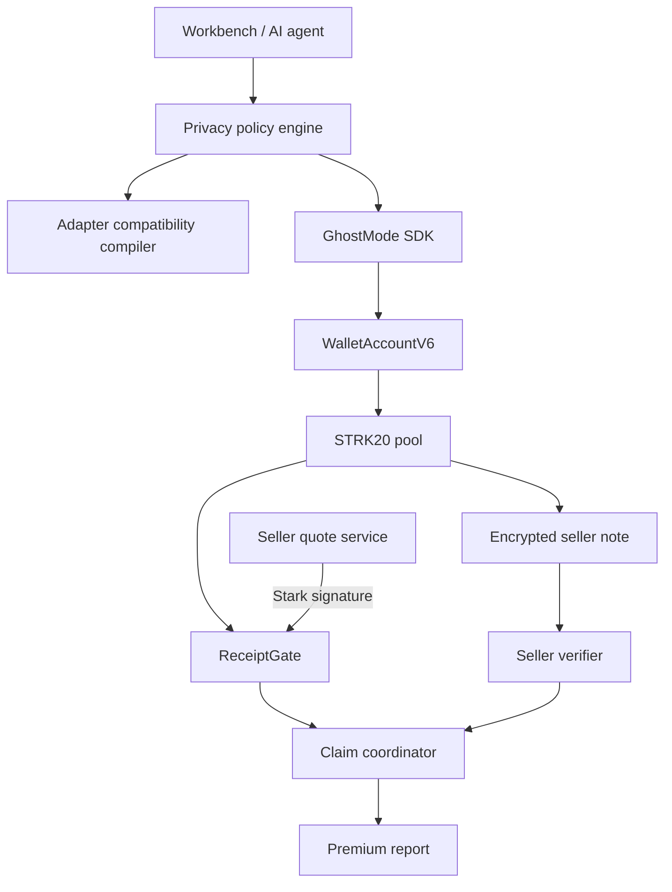

# Architecture

GhostMode is an orchestration layer, not a new privacy pool, prover, wallet, or anonymity network.

## Policy plane

`evaluatePrivacy` separates requested privacy from actual route properties. It can return private transfer, private invoke, explicitly public execution, or unsupported. Public execution is possible only when no privacy property was requested. The compatibility compiler additionally enforces the one-external-invoke budget and open-note visibility.

## Execution plane

The browser uses the exact installed `starknet.js 10.4.0` WalletAccountV6 interface. Wallet discovery is dynamic. The privacy wallet retains keys, notes, and proving state. GhostMode creates typed actions and always simulates a purchase before submission.

The purchase is one STRK20 transaction with two ordered actions: encrypted transfer to the registered seller and invocation of ReceiptGate. The invoke is public, but it contains only pool placeholder, opaque request ID, resource commitment, expiry, and seller authority signature.

## Receipt and authorization plane

The server signs Poseidon of gate address, request ID, resource commitment, and expiry with a quote-only Stark key. ReceiptGate pins the STRK20 pool and authority public key. It verifies caller, placeholder, inputs, time, replay state, and signature before emitting and consuming. The signature cannot spend seller funds.

## Verification and release plane

Public receipt verification proves that the exact gate accepted the exact opaque request in a successful transaction. Seller discovery separately proves that one unambiguous expected note arrived for the configured seller in that accepted block. Both are required. The local store uses a synchronous pending → submitted → released transition to prevent duplicate release within one process.

## Trust boundaries

- Browser: untrusted UI, no privacy keys.
- Wallet: trusted for keys, note discovery, proof construction, and user consent.
- Quote service: trusted to authorize commercial requests, not to spend payments.
- ReceiptGate: deterministic public authorization/replay boundary, cannot decrypt notes.
- Seller verifier: high-value isolated service with discovery and account credentials.
- Quote store: demo-only; replace with durable transactional state for multiple replicas.

No component claims to hide HTTP traffic, target-contract calldata, public state, shield/unshield edges, or timing.
