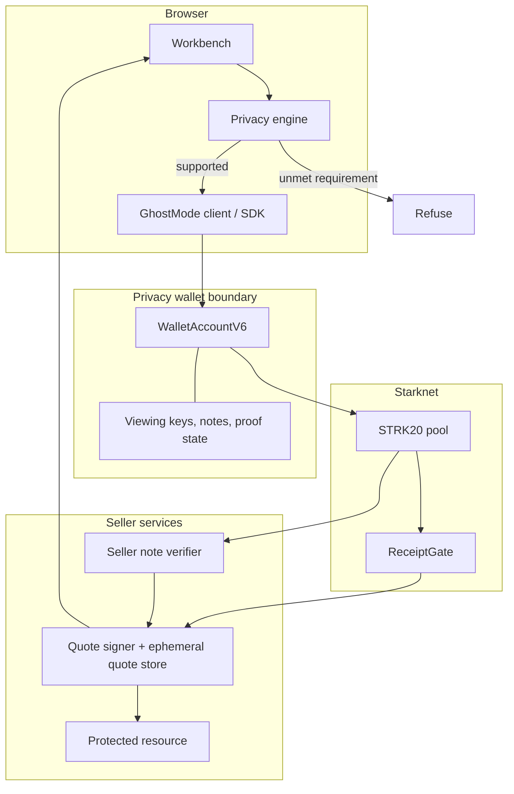
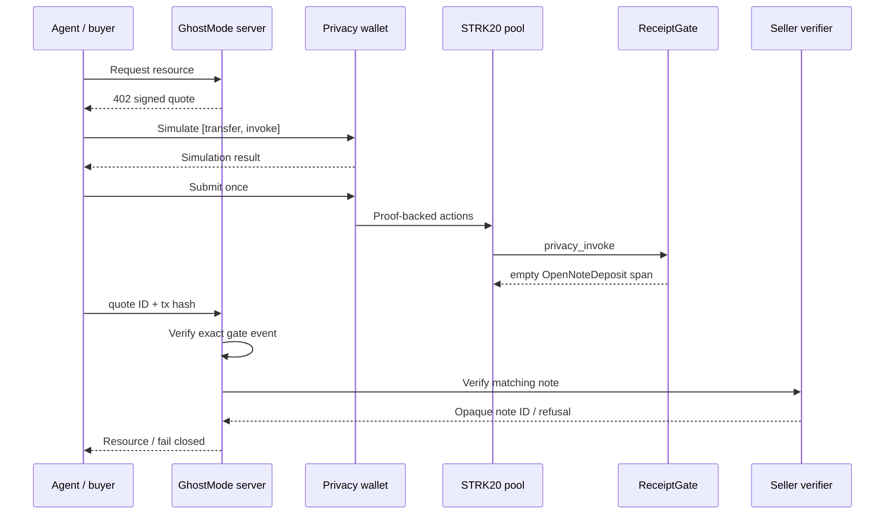

# Architecture

GhostMode is an orchestration layer. It is not a new pool, prover, wallet, privacy network, confidential-compute system, or audit.

## System map

## Data flow

1. `GET /api/demo-intel` creates a resource, hashes it into a field-sized commitment, creates a random quote ID, and signs `[gate, quoteId, commitment, expiry]` with the quote-authority key.
2. The server returns `402` with a `PaymentQuote`. Resource bytes remain only in the process-local quote store.
3. `planAgentAction` and `evaluatePrivacy` classify requested confidentiality. `analyzeCompatibility` separately checks the route shape, one-invoke budget, open-note output, and impossible calldata/state requirements.
4. `buildPrivatePurchaseActions` creates exactly two ordered wallet actions: encrypted transfer to the seller, then invoke `ReceiptGate` with opaque quote data.
5. `GhostModeClient.simulate` calls `strk20PrepareInvoke(actions, true)`. Submission is a distinct step through `strk20InvokeTransaction`.
6. The wallet owns viewing keys, note discovery, proof construction, consent, and submission. The browser never receives these secrets.
7. The pool executes the transfer and `privacy_invoke` atomically. Any gate revert reverts the whole pool transaction.
8. `POST /api/payment/verify` verifies the exact successful `ReceiptAccepted` event and calls the authenticated seller verifier.
9. The verifier discovers seller notes for the expected token and requires exactly one matching amount created in the accepted transaction block.
10. The quote store transitions `pending → submitted → released` and returns the resource once verification succeeds.

## Privacy evaluation

`evaluatePrivacy` has four routes:

- `STRK20_PRIVATE_TRANSFER`: normal encrypted transfer; the requested sender, recipient, token, and amount properties can be private.
- `STRK20_PRIVATE_INVOKE`: protects private note ownership, but helper, calldata, target state, and open-note outputs may be visible.
- `PUBLIC_STARKNET`: returned only when no confidentiality property was requested.
- `UNSUPPORTED`: used when the request cannot be satisfied honestly.

The 100-point score is explanatory, not a cryptographic guarantee or anonymity-set measurement. See [privacy checker](privacy-checker.md).

## Payment route

## Trust boundaries

| Component | Trusted for | Not trusted for |
|---|---|---|
| Browser UI | Presenting intent and wallet prompts | Key custody, truthful privacy by itself |
| Privacy wallet | Viewing/spending keys, note discovery, proof creation, user consent | Hiding deposits, withdrawals, timing, or public invoke data |
| RPC | Returning chain data | Confidentiality or perfect availability |
| Prover/discovery services | Correct service operation according to STRK20 | Network anonymity; they can observe requests within their protocol boundary |
| Quote service | Commercial terms and resource commitment | Spending seller funds |
| ReceiptGate | Pool caller, authorization, expiry, replay | Decrypting or validating payment note contents |
| Seller verifier | Seller note discovery and match decision | Public availability; compromise exposes high-value credentials |
| Quote store | Demo coordination within one process | Durability, multi-replica consistency, production recovery |

## Error and recovery design

- Invalid or unsupported privacy fails before submission.
- Purchase actions are simulated before submission.
- Once a wallet returns a hash, confirmation uncertainty is treated as “possibly submitted,” never “safe to retry.”
- A wallet timeout without a hash triggers bounded searches for the expected deposit or gate event.
- Resource release requires both public gate evidence and private seller-note discovery.
- Ambiguous equal-amount same-block notes fail closed.
- Restarting the app loses the ephemeral quote store; production needs transactional durable storage.

## Design decisions

### Wallet API for buyers

The user-facing dApp uses the Wallet API so the wallet retains viewing keys, notes, proving state, and consent. Asking a normal dApp user for a viewing key would move the privacy boundary into the website.

### Lower-level SDK only for the seller

The seller must discover incoming notes, so `seller-verifier/` uses the Privacy SDK in a separate service. The current setup also holds an account signer; isolation and a dedicated low-value identity are required.

### Opaque receipt rather than payment calldata

ReceiptGate sees a random quote ID, resource commitment, expiry, and seller signature. Payment token, amount, buyer, and seller-recipient address are not gate parameters. The seller verifier separately checks the private note.

### No generated arbitrary Cairo

The compatibility compiler produces a boundary report, not an audit. Protocol-specific helpers require implementation, review, deployment, and explicit disclosure of public calldata/state.

## Extending GhostMode

### Add a privacy route

Add the route type in `types.ts`, implement exact classification in `privacy-engine.ts`, register its boundaries in `registry.ts`, add action construction and tests, then update privacy, compatibility, API, and limitation docs. Never reuse a more-private classification for a weaker route.

### Add a token

Centralize the address/decimals per network, validate the token as a felt, query current pool fees rather than hardcoding a maximum, test felt normalization, and document whether its shield/unshield behavior differs.

### Add a Starknet network

Add the network type, chain ID, RPC, pool address, explorer, UI gating, quote validation, deployment script, read-only check, and tests. Do not infer network from an address.

### Add a seller integration

Implement the quote endpoint, resource commitment, durable request record, quote authorization, authenticated verification call, idempotent release, and a recovery process. Keep seller keys outside the browser.

### Add an agent action or policy

Define a typed intent, explicit requirements, actual exposure matrix, unsupported conditions, alternatives, deterministic tests, and SDK/API docs. A policy must never silently weaken the caller's requirements.

### Add a private-invoke adapter

First check for an upstream private path. Otherwise implement and review a Cairo `privacy_invoke` helper, pin the expected pool when stateful, validate inputs, respect the one-external-invoke budget, approve returned assets to the pool, and return exact balance deltas. Open-note token/amount and public target state must be disclosed.
